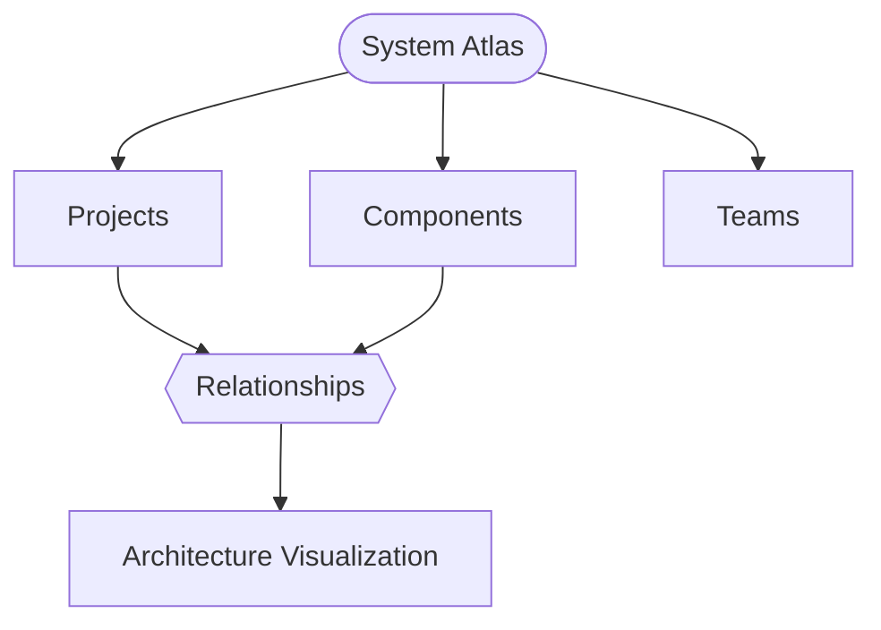
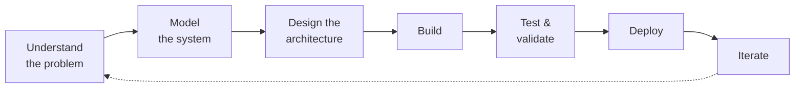

# 👋 Hey, I'm Muhammad Rashwan

### Software Developer · Full-Stack Engineer · AI-Powered Development

*Engineering mindset. Software execution. Intelligent systems.*

  
  

---

## 🧠 About Me

I'm a **Software Developer with an Electrical Engineering background**, interested in building software systems that go beyond simple applications. My work sits at the intersection of:

**Software Engineering × AI × Architecture × Automation**

I enjoy understanding how a system works as a whole, from the user interface and APIs down to databases, infrastructure, and the architecture underneath.

| | |
|---|---|
| 🎓 **Education** | Electrical Power Engineering, Class of 2024 |
| 💻 **Training** | AI-Powered Software Development |
| 🚀 **Core stack** | Full-Stack with the MERN ecosystem |
| 🏗️ **Focus** | Software Architecture & System Design |
| ☁️ **Building experience in** | Cloud, DevOps & Infrastructure |
| ⚡ **Long-term interest** | Robotics, Automation & Intelligent Systems |

> **I don't just want to build applications. I want to understand and engineer the systems behind them.**

---

## 🛠️ Tech Stack

| | Technologies |
|---|---|
| **💻 Frontend & Backend** |  |
| **🗄️ Data & APIs** |  REST APIs · JWT Authentication · Database Design |
| **☁️ DevOps & Cloud** |  CI/CD · Cloud Infrastructure |
| **🧠 Engineering** | Software Architecture · System Design · Data Modeling · Secure Software Development · AI-Assisted Development · Automation |

---

## 🚀 Featured Projects

### 🧩 System Atlas
**_Master Your Architectural Complexity._**

A software architecture visualization and knowledge-mapping platform that helps teams understand complex systems by turning relationships between software components into an interactive visual graph.

**Built with:** `React` `Node.js` `Express` `MongoDB` `Neo4j` `Cytoscape.js`

<b>🔑 Core features</b>

 

- 🏢 Workspaces & projects
- 🧩 Software components
- 🔗 Component relationships
- 👥 Teams & role management
- 📝 Technical metadata
- 🔐 Authentication & invitations
- 🗺️ Interactive architecture visualization
- 📚 Architecture knowledge mapping

 

### More projects

| 🛍️ VisioCreate | 👀 Watchlist |
|---|---|
| A modern full-stack e-commerce platform built around a responsive user experience and structured backend architecture. | A media watchlist app focused on a clean, interactive browsing experience. |
| **Frontend:** React 19 · Vite · Tailwind CSS · Framer Motion · Swiper · React Hook Form | |
| **Backend:** Node.js · Express 5 · MongoDB · JWT · Bcrypt · Multer · Axios | |
| [🔗 Live Demo](https://visiocreate.vercel.app/) | [🔗 Live Demo](https://notyourtypicalwatchlist.vercel.app/) |

---

## 🧪 How I Work

I approach software with an engineering mindset:

### 🎯 Currently Exploring

---

## 🎓 Background

**⚡ Electrical Power Engineering** — a foundation in electrical systems, problem solving, mathematics, and technical analysis.

**🤖 AI-Powered Software Development** — specialized training covering Full-Stack Development (MERN), Software Development Fundamentals, Secure Software Development, DevOps Fundamentals, Cloud & Deployment, and AI-assisted development.

---

## 📊 GitHub Activity

<b>📈 Activity graph & contribution snake</b>

 

---

## 🤝 Let's Connect

